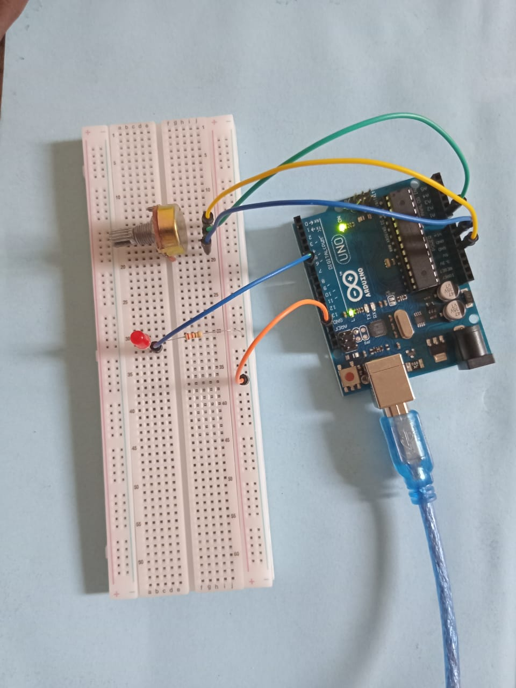

# LED Brightness Control Using a Potentiometer

A beginner Arduino project that controls the brightness of an LED using a potentiometer and PWM (Pulse Width Modulation).

The Arduino supplies 5V to the potentiometer and reads the varying output voltage through an analog input pin (`A0`). Based on the voltage level controlled by the potentiometer, the Arduino adjusts the brightness of the LED connected to a PWM-enabled digital pin.

## 📚 Concepts Learned
- Analog input reading using `analogRead()`
- PWM output using `analogWrite()`
- Voltage control with a potentiometer
- Mapping analog values to LED brightness
- Basic circuit design and signal control

## 🛠️ Components Used
- Arduino Uno
- Potentiometer
- LED
- Resistor
- Breadboard
- Jumper wires

## ⚙️ Circuit Description
- The Arduino provides a 5V supply to the potentiometer.
- The potentiometer acts as a variable voltage divider.
- The varying voltage output from the potentiometer is connected to analog pin `A0` for the Arduino to read.
- The LED is connected to PWM pin `6`.
- Based on the potentiometer value, the Arduino changes the LED brightness using PWM output.

## Circuit Preview

